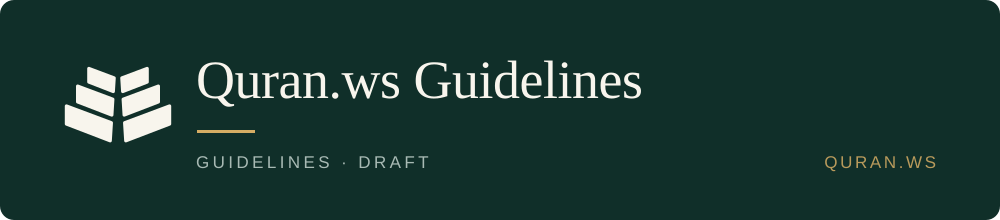

<div align="center">



**How Quran.ws builds software that handles the Qurʾān: naming, the text, versioning and corrections, engineering, and repositories. Every rule is one sentence, an example, and the check that catches a violation.**

<a href="https://quran.ws/docs/guidelines/naming/"></a>
<a href="https://quran.ws/docs/guidelines/reference/dictionary/"></a>

</div>

Use it when you are naming a table, storing Qurʾānic text, releasing a dataset or deciding what a dependant may rely on, and want the answer Quran.ws has already settled, with the check that enforces it. Written in Arabic and English from one source, so the two cannot drift apart.

> كيف يبني Quran.ws برمجيات تتعامل مع القرآن: التسمية، والنص القرآني، والإصدارات والتصحيحات، والهندسة، والمستودعات. نصوغ كل قاعدة في جملة واحدة ونرفق بها مثالًا وفحصًا يكشف مخالفتها.
>
> استخدمها عندما تسمّي جدولًا، أو تخزّن نصًا قرآنيًا، أو تنشر إصدارًا من البيانات، أو تقرّر ما يعتمد عليه من يستخدم مشروعك، وتريد الجواب الذي استقرّ عليه Quran.ws مع الفحص الذي يضمنه. الأدلة مكتوبة بالعربية والإنجليزية من مصدر واحد حتى تبقى النسختان متوافقتين.

| | |
|---|---|
| **Guidelines** | 5 pages · Arabic and English |
| **Reference** | the dictionary, 180 concepts and 755 spellings · 7 registries · the standard · the decision record |
| **Status** | Proposed. Nothing is adopted yet |
| **Licence** | CC BY 4.0 (prose) · MIT (code, schemas and machine-readable data) · the Qurʾānic text itself is covered by neither |

> [!IMPORTANT]
> Nothing is adopted yet. Build against a page only once it is marked `adopted`. These are opinions, not rulings and not official standards: what concerns the Qurʾānic text itself is reviewed by qualified scholars, and what concerns engineering is one defensible choice among several.

```sh
# the terminology audit: reads your repository, reports every name the standard
# would have written differently, renames nothing
python3 skills/quranic-terminology/scripts/audit_terminology.py src --strict
```

## Where the documentation is

Everything about using it lives on the site. This repository is the source.

| | |
|---|---|
| **Start with naming** | [quran.ws/docs/guidelines/naming/](https://quran.ws/docs/guidelines/naming/) |
| **The dictionary** | [quran.ws/docs/guidelines/reference/dictionary/](https://quran.ws/docs/guidelines/reference/dictionary/) |
| **Qurʾān text** | [quran.ws/docs/guidelines/quranic-text/](https://quran.ws/docs/guidelines/quranic-text/) |
| **Versioning and corrections** | [quran.ws/docs/guidelines/versioning/](https://quran.ws/docs/guidelines/versioning/) |
| **Engineering** | [quran.ws/docs/guidelines/engineering/](https://quran.ws/docs/guidelines/engineering/) |
| **Repositories and licensing** | [quran.ws/docs/guidelines/repositories/](https://quran.ws/docs/guidelines/repositories/) |
| **Waqf and open licensing** | [quran.ws/docs/guidelines/licensing/](https://quran.ws/docs/guidelines/licensing/) |
| **Registries, the standard, the decisions** | [quran.ws/docs/guidelines/reference/registries/](https://quran.ws/docs/guidelines/reference/registries/) |
| **بالعربية** | [quran.ws/docs/guidelines/ar/naming/](https://quran.ws/docs/guidelines/ar/naming/) |
| **How to contribute** | [quran.ws/docs/contribute/](https://quran.ws/docs/contribute/) |
| **Licensing in full** | [quran.ws/docs/reference/licensing](https://quran.ws/docs/reference/licensing) |

## What is in here

| | |
|---|---|
| `content/pages/` | the source of the five guideline pages: one rule file each, both languages; `content/en/` and `content/ar/` are rendered from it |
| `content/` | the rendered pages, the prose pages (licensing, the standard, the decision record) and `glossary.json` |
| `standards/terminology/` | the machine-readable terminology: concepts, spellings, registries and their schema |
| `skills/quranic-terminology/` | the audit above, and the same thing as a Claude Code plugin: `/plugin marketplace add quran-ws/docs` |
| `examples/` | samples in canonical names: a database schema, an API, data, a migration and tests |
| `surveys/` | real codebases measured against the standard. Findings, not rules |
| `tools/` | derive, check, generate: `python3 tools/build.py` |
| `tests/` | the gates that must stay green |
| `.github/ISSUE_TEMPLATE/` | three forms: propose a term, propose a guideline, suggest an edit. A rule or a term changes through an issue; a typo goes straight to a PR. [CONTRIBUTING.md](CONTRIBUTING.md) has the detail |

Issues and pull requests are welcome here. Everything that is not about *changing* this repository is on the site.
